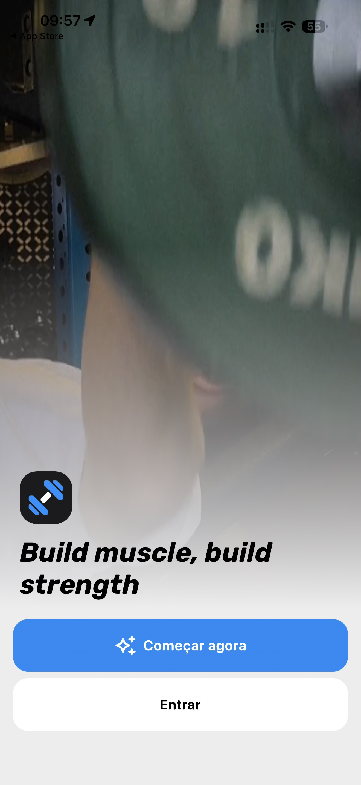

# 001 — Boas-vindas

## Descrição fiel

Captura vertical da tela inicial do app. Ao fundo há um vídeo/foto desfocado de uma pessoa treinando em uma academia, escurecido na parte superior e coberto por um degradê claro na parte inferior. A barra do iPhone mostra 09:57, retorno para “App Store”, Wi‑Fi e bateria em 55%. Próximo ao rodapé aparece o ícone quadrado preto do app, com símbolo geométrico azul e branco. A chamada em inglês, grande, preta, inclinada e em negrito diz “Build muscle, build strength”. Há dois botões largos e arredondados: “Começar agora”, em azul, com ícone branco de brilhos, e “Entrar”, branco, com texto preto.

## Estado e ação representados

Esta captura registra **boas-vindas** no fluxo. Elementos acinzentados indicam seleção, indisponibilidade ou conteúdo ao fundo, conforme descrito acima; azul identifica ações navegáveis ou primárias e verde identifica controles ativos.

## Sequência

- **Imagem anterior:** `—`
- **Próxima imagem:** `002-onboarding-selecionar-genero.JPG`
