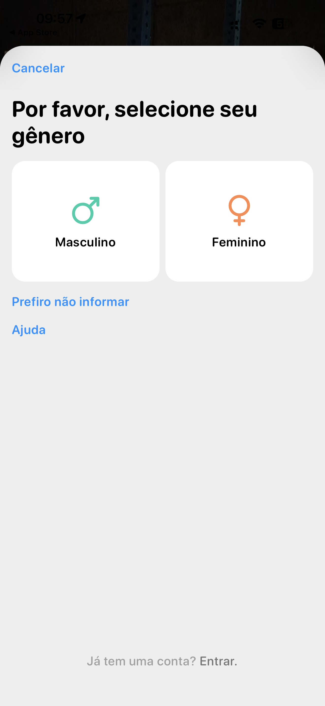

# 002 — Seleção de gênero

## Descrição fiel

Folha modal clara, com cantos superiores arredondados, sobre o fundo escurecido da tela inicial. No alto há “Cancelar” em azul. O título é “Por favor, selecione seu gênero”. Abaixo há dois cartões brancos lado a lado: “Masculino”, com símbolo masculino verde, e “Feminino”, com símbolo feminino laranja. Nenhum cartão está selecionado. Abaixo aparecem os links azuis “Prefiro não informar” e “Ajuda”. No rodapé, em cinza, lê-se “Já tem uma conta? Entrar.”

## Estado e ação representados

Esta captura registra **seleção de gênero** no fluxo. Elementos acinzentados indicam seleção, indisponibilidade ou conteúdo ao fundo, conforme descrito acima; azul identifica ações navegáveis ou primárias e verde identifica controles ativos.

## Sequência

- **Imagem anterior:** `001-boas-vindas.JPG`
- **Próxima imagem:** `003-onboarding-selecionar-experiencia.JPG`
