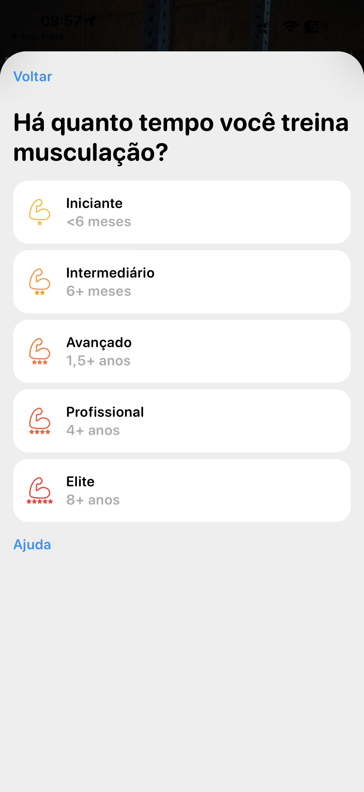

# 003 — Seleção de experiência

## Descrição fiel

Folha modal clara com ação “Voltar” em azul e o título “Há quanto tempo você treina musculação?”. Cinco cartões brancos verticais apresentam níveis de experiência, cada um com ícone de braço e estrelas em um degradê amarelo–vermelho: “Iniciante — <6 meses”, “Intermediário — 6+ meses”, “Avançado — 1,5+ anos”, “Profissional — 4+ anos” e “Elite — 8+ anos”. Nenhuma opção está marcada. Há o link “Ajuda” em azul abaixo da lista.

## Estado e ação representados

Esta captura registra **seleção de experiência** no fluxo. Elementos acinzentados indicam seleção, indisponibilidade ou conteúdo ao fundo, conforme descrito acima; azul identifica ações navegáveis ou primárias e verde identifica controles ativos.

## Sequência

- **Imagem anterior:** `002-onboarding-selecionar-genero.JPG`
- **Próxima imagem:** `004-onboarding-experiencia-intermediaria.JPG`
