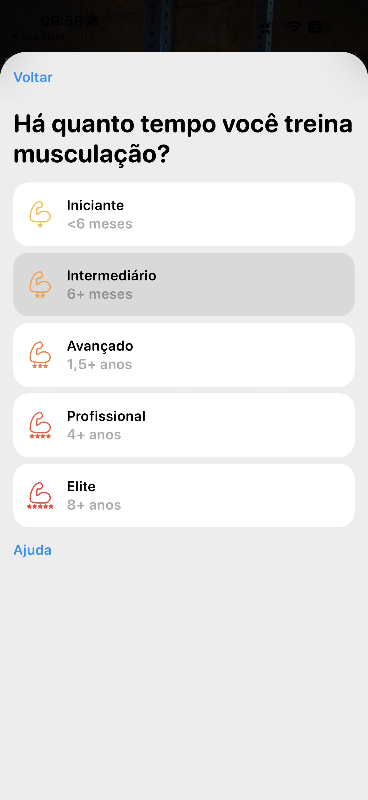

# 004 — Experiência intermediária selecionada

## Descrição fiel

A mesma tela de seleção de experiência da imagem anterior, com “Voltar”, o título “Há quanto tempo você treina musculação?” e os cinco níveis. O cartão “Intermediário — 6+ meses” está selecionado e aparece com fundo cinza; os demais cartões permanecem brancos. O nível intermediário usa um ícone laranja de braço com duas estrelas. O link “Ajuda” continua abaixo da lista.

## Estado e ação representados

Esta captura registra **experiência intermediária selecionada** no fluxo. Elementos acinzentados indicam seleção, indisponibilidade ou conteúdo ao fundo, conforme descrito acima; azul identifica ações navegáveis ou primárias e verde identifica controles ativos.

## Sequência

- **Imagem anterior:** `003-onboarding-selecionar-experiencia.JPG`
- **Próxima imagem:** `005-onboarding-genero-masculino.JPG`
