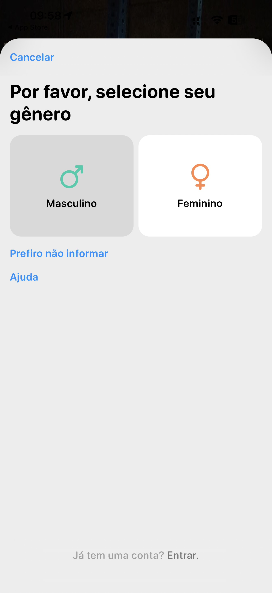

# 005 — Gênero masculino selecionado

## Descrição fiel

Tela de seleção de gênero em uma folha modal. No topo aparece “Cancelar” em azul e o título “Por favor, selecione seu gênero”. O cartão “Masculino”, à esquerda, está selecionado com fundo cinza e símbolo masculino verde; o cartão “Feminino”, à direita, permanece branco com símbolo feminino laranja. Abaixo estão “Prefiro não informar” e “Ajuda” em azul. No rodapé aparece “Já tem uma conta? Entrar.” em cinza.

## Estado e ação representados

Esta captura registra **gênero masculino selecionado** no fluxo. Elementos acinzentados indicam seleção, indisponibilidade ou conteúdo ao fundo, conforme descrito acima; azul identifica ações navegáveis ou primárias e verde identifica controles ativos.

## Sequência

- **Imagem anterior:** `004-onboarding-experiencia-intermediaria.JPG`
- **Próxima imagem:** `006-onboarding-informar-peso.JPG`
