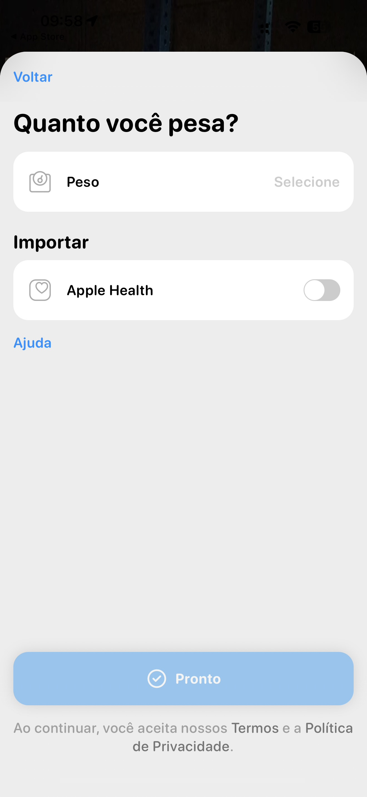

# 006 — Informar peso

## Descrição fiel

Tela “Quanto você pesa?” em uma folha clara com cantos superiores arredondados e link “Voltar”. O primeiro cartão contém ícone de balança, rótulo “Peso” e o placeholder “Selecione”. A seção “Importar” traz um cartão “Apple Health”, ícone de coração e chave desligada em cinza. Há um link “Ajuda”. No rodapé, o botão largo “Pronto”, com ícone de confirmação, está azul-claro/desabilitado. Abaixo lê-se “Ao continuar, você aceita nossos Termos e a Política de Privacidade.”

## Estado e ação representados

Esta captura registra **informar peso** no fluxo. Elementos acinzentados indicam seleção, indisponibilidade ou conteúdo ao fundo, conforme descrito acima; azul identifica ações navegáveis ou primárias e verde identifica controles ativos.

## Sequência

- **Imagem anterior:** `005-onboarding-genero-masculino.JPG`
- **Próxima imagem:** `007-onboarding-editar-peso-kg.JPG`
