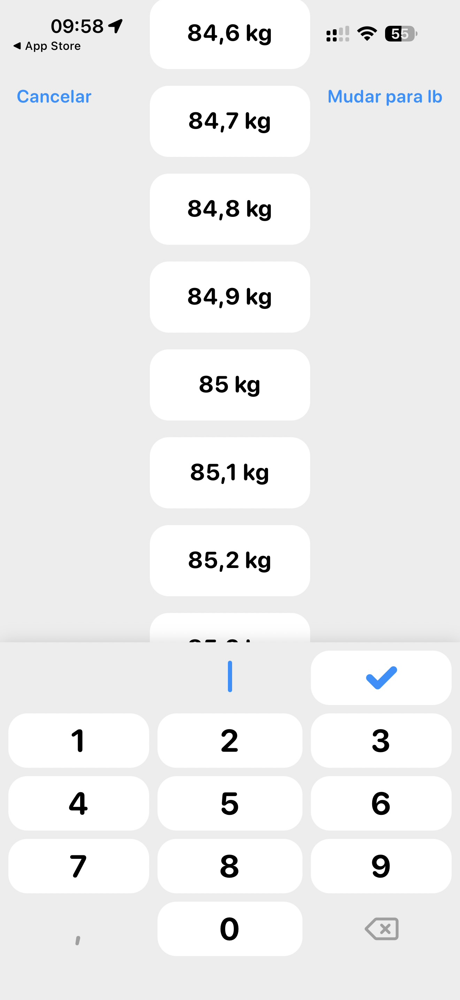

# 007 — Seletor de peso em quilogramas

## Descrição fiel

Seletor de peso aberto em tela cheia. No centro há uma lista vertical de valores em cartões brancos: 84,6 kg, 84,7 kg, 84,8 kg, 84,9 kg, 85 kg, 85,1 kg e 85,2 kg, com continuidade fora da área visível. No topo aparecem “Cancelar” à esquerda e “Mudar para lb” à direita, ambos em azul. Um teclado numérico ocupa a parte inferior, com campo de entrada vazio, tecla de confirmação azul, números 0–9, vírgula e apagar. A barra do iPhone indica 09:58 e bateria em 55%.

## Estado e ação representados

Esta captura registra **seletor de peso em quilogramas** no fluxo. Elementos acinzentados indicam seleção, indisponibilidade ou conteúdo ao fundo, conforme descrito acima; azul identifica ações navegáveis ou primárias e verde identifica controles ativos.

## Sequência

- **Imagem anterior:** `006-onboarding-informar-peso.JPG`
- **Próxima imagem:** `008-onboarding-editar-peso-alternativo.JPG`
