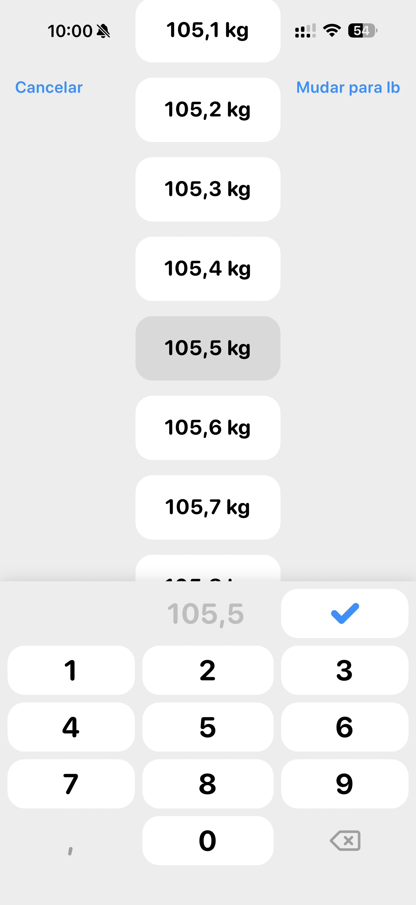

# 008 — Peso 105,5 kg selecionado

## Descrição fiel

Seletor de peso em quilogramas com lista vertical de 105,1 kg a 105,7 kg. O valor “105,5 kg” está selecionado e destacado por um cartão cinza; o mesmo número aparece no campo acima do teclado. No topo há “Cancelar” e “Mudar para lb”. O teclado numérico mostra números, vírgula, apagar e uma tecla grande com check azul. A barra de status marca 10:00, modo silencioso e bateria em 54%.

## Estado e ação representados

Esta captura registra **peso 105,5 kg selecionado** no fluxo. Elementos acinzentados indicam seleção, indisponibilidade ou conteúdo ao fundo, conforme descrito acima; azul identifica ações navegáveis ou primárias e verde identifica controles ativos.

## Sequência

- **Imagem anterior:** `007-onboarding-editar-peso-kg.JPG`
- **Próxima imagem:** `009-onboarding-conectar-apple-health.JPG`
