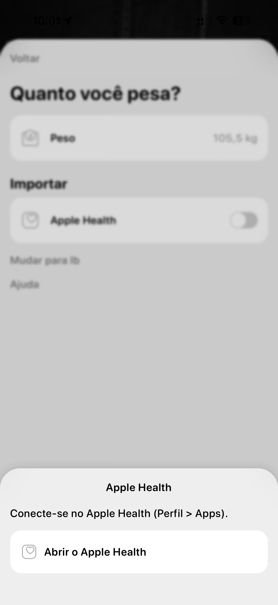

# 009 — Aviso de conexão com Apple Health

## Descrição fiel

A tela de peso aparece desfocada e escurecida ao fundo, já com “105,5 kg”. Sobre ela foi aberta uma folha inferior branca intitulada “Apple Health”. A mensagem diz “Conecte-se no Apple Health (Perfil > Apps).”. A única ação é um cartão/botão branco com ícone de coração e o texto “Abrir o Apple Health”. Ao fundo ainda são reconhecíveis a chave desligada do Apple Health e os links “Mudar para lb” e “Ajuda”.

## Estado e ação representados

Esta captura registra **aviso de conexão com apple health** no fluxo. Elementos acinzentados indicam seleção, indisponibilidade ou conteúdo ao fundo, conforme descrito acima; azul identifica ações navegáveis ou primárias e verde identifica controles ativos.

## Sequência

- **Imagem anterior:** `008-onboarding-editar-peso-alternativo.JPG`
- **Próxima imagem:** `010-onboarding-peso-confirmado.JPG`
