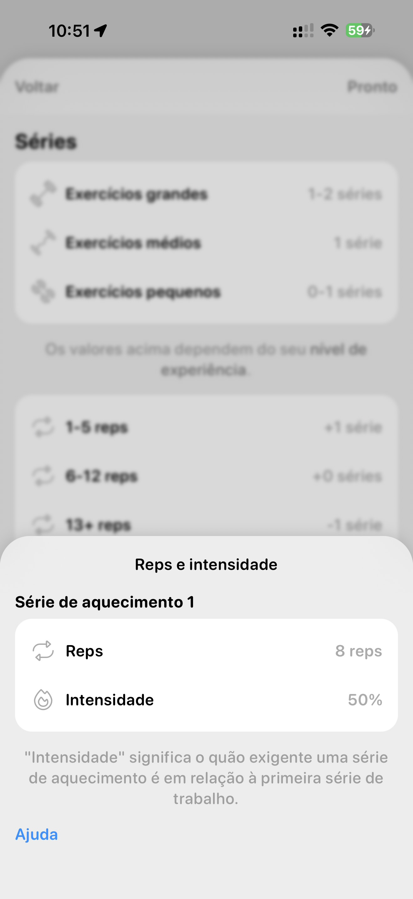

# 098 — Configurar Reps E Intensidade

## Identificação

- **Arquivo da imagem:** `098-configurar-reps-e-intensidade.JPG`
- **Posição no workflow:** 98 de 134
- **Etapa:** Configurar Reps E Intensidade

## Descrição da tela

Tela do aplicativo de musculação exibindo uma etapa específica do fluxo do usuário. O conteúdo central corresponde a **configurar reps e intensidade**. A tela apresenta título no topo, conteúdo principal organizado em cartões, listas, seletores ou painéis e, quando aplicável, uma ação de avanço, confirmação, salvamento ou fechamento.

## Elementos visuais

- **Formato:** captura vertical de um aplicativo móvel em iPhone.
- **Estilo visual:** interface clara, fundo branco/cinza-claro, cartões arredondados, tipografia escura e destaques em azul; controles ativos podem aparecer em verde.
- **Barra superior:** área de navegação com título e, conforme a etapa, ações como voltar, cancelar, ajuda, pronto, fechar, criar ou compartilhar.
- **Área principal:** informações e controles referentes a “configurar reps e intensidade”.
- **Área inferior:** quando presente, botão principal em largura ampla ou barra de navegação por abas.

## Finalidade no fluxo

Esta referência documenta a etapa **Configurar Reps E Intensidade** e deve ser usada para reproduzir a hierarquia visual, os estados dos controles, o espaçamento e a navegação mostrados na captura.

## Navegação na sequência

- **Anterior:** `097-configurar-quantidade-series.JPG`
- **Próxima:** `099-configurar-repeticoes-aquecimento.JPG`
