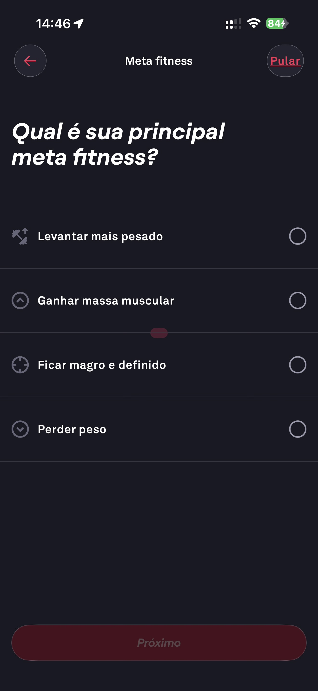

# 003 — Onboarding Meta Fitness

## Descrição fiel

Etapa “Meta fitness” perguntando “Qual é sua principal meta fitness?”, com opções levantar mais pesado, ganhar massa muscular, ficar magro e definido e perder peso; nenhuma marcada e botão Próximo inativo.

## Identificação

- **Aplicativo:** Fitbod
- **Arquivo:** `003-onboarding-meta-fitness.JPG`
- **Posição no conjunto:** 3 de 97

## Sequência

- **Anterior:** `002-login.JPG`
- **Próxima:** `004-onboarding-meta-fitness-definicao.JPG`
