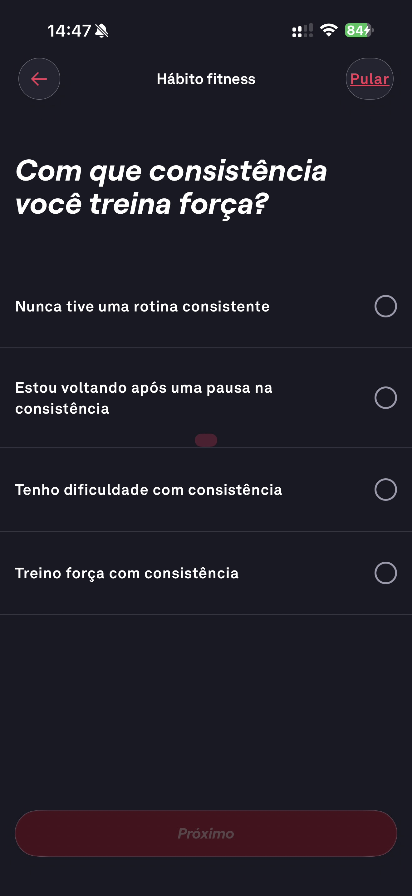

# 005 — Onboarding Consistencia

## Descrição fiel

Etapa “Hábito fitness” perguntando com que consistência o usuário treina força; quatro opções aparecem sem seleção e o botão Próximo está inativo.

## Identificação

- **Aplicativo:** Fitbod
- **Arquivo:** `005-onboarding-consistencia.JPG`
- **Posição no conjunto:** 5 de 97

## Sequência

- **Anterior:** `004-onboarding-meta-fitness-definicao.JPG`
- **Próxima:** `006-onboarding-consistencia-retorno.JPG`
