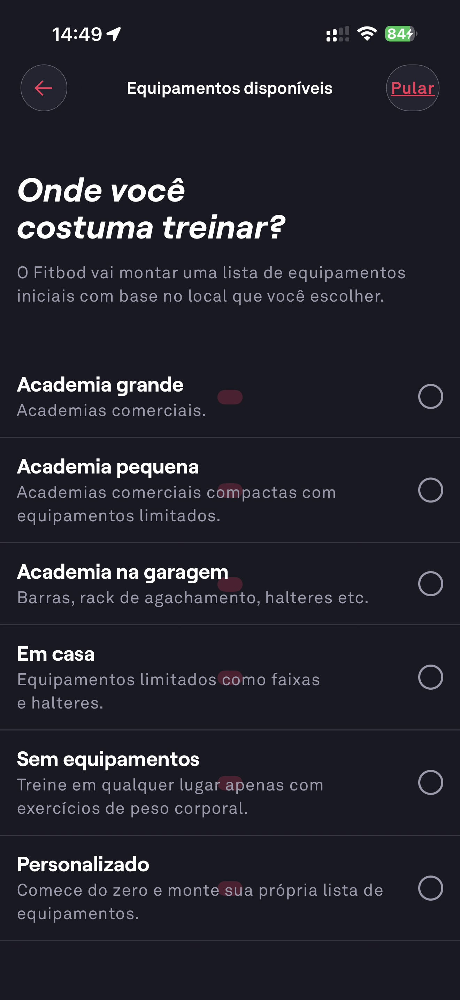

# 009 — Onboarding Local De Treino

## Descrição fiel

Etapa “Equipamentos disponíveis” perguntando onde o usuário costuma treinar; lista academia grande, pequena, garagem, em casa, sem equipamentos e personalizado, sem seleção.

## Identificação

- **Aplicativo:** Fitbod
- **Arquivo:** `009-onboarding-local-de-treino.JPG`
- **Posição no conjunto:** 9 de 97

## Sequência

- **Anterior:** `008-onboarding-experiencia-dois-anos.JPG`
- **Próxima:** `010-onboarding-academia-pequena.JPG`
