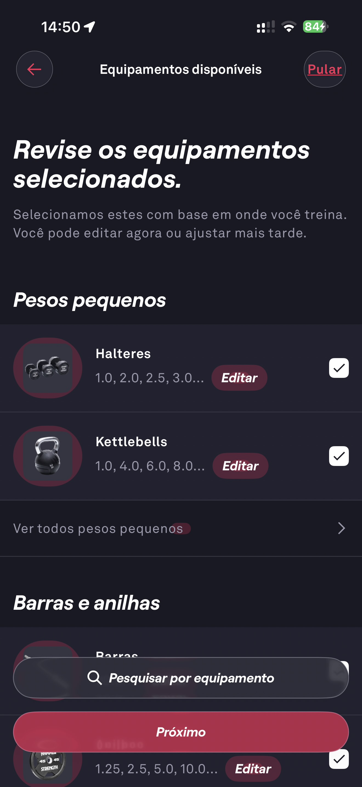

# 011 — Onboarding Revisar Equipamentos Pesos

## Descrição fiel

Tela “Revise os equipamentos selecionados”, mostrando pesos pequenos como halteres e kettlebells, caixas de seleção, valores de peso e ações “Editar”; início da seção barras e anilhas.

## Identificação

- **Aplicativo:** Fitbod
- **Arquivo:** `011-onboarding-revisar-equipamentos-pesos.JPG`
- **Posição no conjunto:** 11 de 97

## Sequência

- **Anterior:** `010-onboarding-academia-pequena.JPG`
- **Próxima:** `012-onboarding-revisar-equipamentos-maquinas.JPG`
