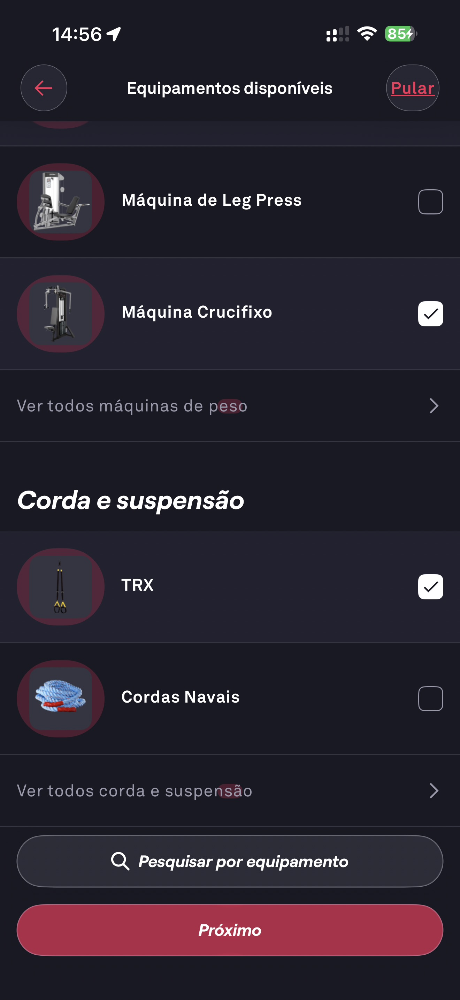

# 012 — Onboarding Revisar Equipamentos Maquinas

## Descrição fiel

Continuação da revisão de equipamentos, com máquinas de leg press e crucifixo, TRX e cordas navais, caixas marcadas/desmarcadas, pesquisa e botão Próximo.

## Identificação

- **Aplicativo:** Fitbod
- **Arquivo:** `012-onboarding-revisar-equipamentos-maquinas.JPG`
- **Posição no conjunto:** 12 de 97

## Sequência

- **Anterior:** `011-onboarding-revisar-equipamentos-pesos.JPG`
- **Próxima:** `013-onboarding-agenda-de-treinos.JPG`
