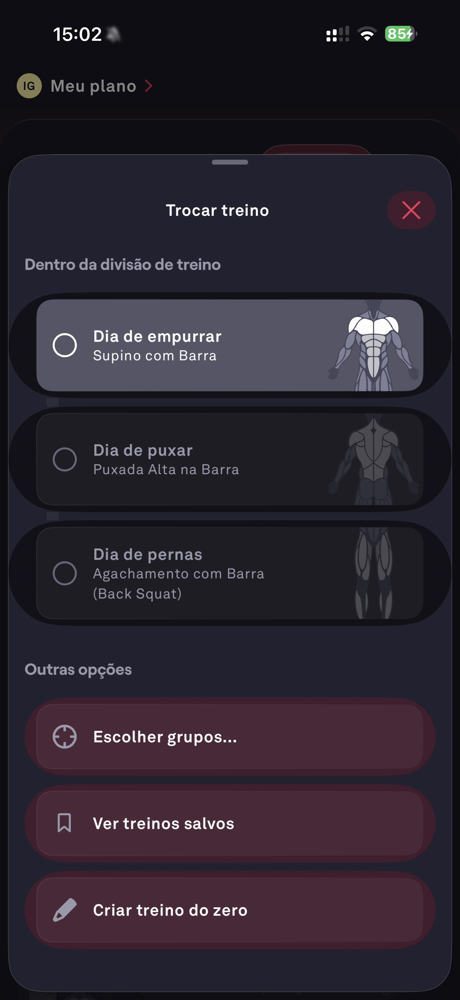

# 028 — Selecionar Treino

## Descrição fiel

Folha “Trocar treino” sobre o plano, listando dias dentro da divisão e ações para escolher grupos, ver treinos salvos ou criar treino do zero.

## Identificação

- **Aplicativo:** Fitbod
- **Arquivo:** `028-selecionar-treino.JPG`
- **Posição no conjunto:** 28 de 97

## Sequência

- **Anterior:** `027-treino-dia-de-empurrar.JPG`
- **Próxima:** `029-menu-opcoes-do-treino.JPG`
