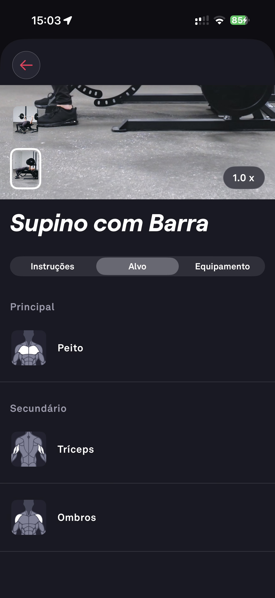

# 034 — Exercicio Supino Musculos Alvo

## Descrição fiel

Aba “Alvo” do Supino com Barra, indicando Peito como músculo principal e Tríceps e Ombros como secundários, com ícones anatômicos.

## Identificação

- **Aplicativo:** Fitbod
- **Arquivo:** `034-exercicio-supino-musculos-alvo.JPG`
- **Posição no conjunto:** 34 de 97

## Sequência

- **Anterior:** `033-exercicio-supino-instrucoes.JPG`
- **Próxima:** `035-exercicio-supino-equipamentos.JPG`
