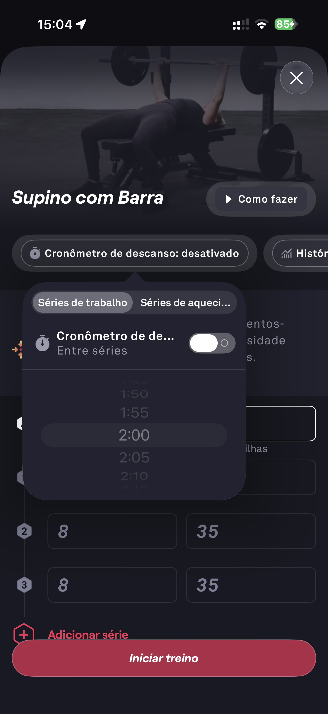

# 036 — Configurar Cronometro Descanso

## Descrição fiel

Popover de configuração do cronômetro de descanso entre séries, com chave liga/desliga e opções de duração, sobre a tela do supino.

## Identificação

- **Aplicativo:** Fitbod
- **Arquivo:** `036-configurar-cronometro-descanso.JPG`
- **Posição no conjunto:** 36 de 97

## Sequência

- **Anterior:** `035-exercicio-supino-equipamentos.JPG`
- **Próxima:** `037-historico-sem-dados.JPG`
