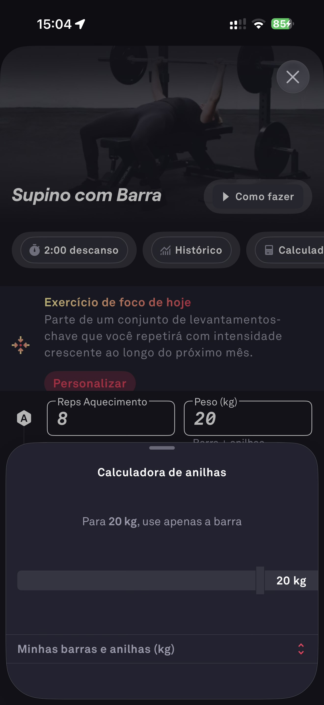

# 040 — Calculadora De Anilhas

## Descrição fiel

Folha “Calculadora de anilhas” sobre o supino, informando que para 20 kg deve ser usada apenas a barra e exibindo configuração de barras/anilhas.

## Identificação

- **Aplicativo:** Fitbod
- **Arquivo:** `040-calculadora-de-anilhas.JPG`
- **Posição no conjunto:** 40 de 97

## Sequência

- **Anterior:** `039-historico-volume-e-repeticoes.JPG`
- **Próxima:** `041-calculadora-de-anilhas-configurada.JPG`
