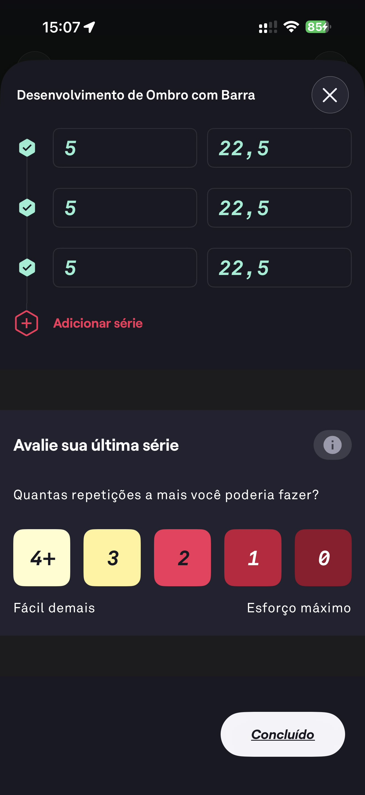

# 055 — Desenvolvimento Ombro Avaliar Serie

## Descrição fiel

Avaliação da última série do desenvolvimento de ombro, usando a mesma escala 4+ a 0, de fácil demais a esforço máximo; botão Concluído.

## Identificação

- **Aplicativo:** Fitbod
- **Arquivo:** `055-desenvolvimento-ombro-avaliar-serie.JPG`
- **Posição no conjunto:** 55 de 97

## Sequência

- **Anterior:** `054-desenvolvimento-ombro-registrar-serie.JPG`
- **Próxima:** `056-lista-exercicios-concluidos.JPG`
