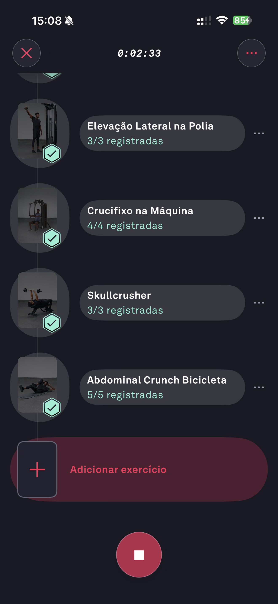

# 056 — Lista Exercicios Concluidos

## Descrição fiel

Lista do treino em andamento mostrando exercícios concluídos com checks verdes, botão “Adicionar exercício” e controle circular de encerrar.

## Identificação

- **Aplicativo:** Fitbod
- **Arquivo:** `056-lista-exercicios-concluidos.JPG`
- **Posição no conjunto:** 56 de 97

## Sequência

- **Anterior:** `055-desenvolvimento-ombro-avaliar-serie.JPG`
- **Próxima:** `057-finalizar-e-registrar-treino.JPG`
