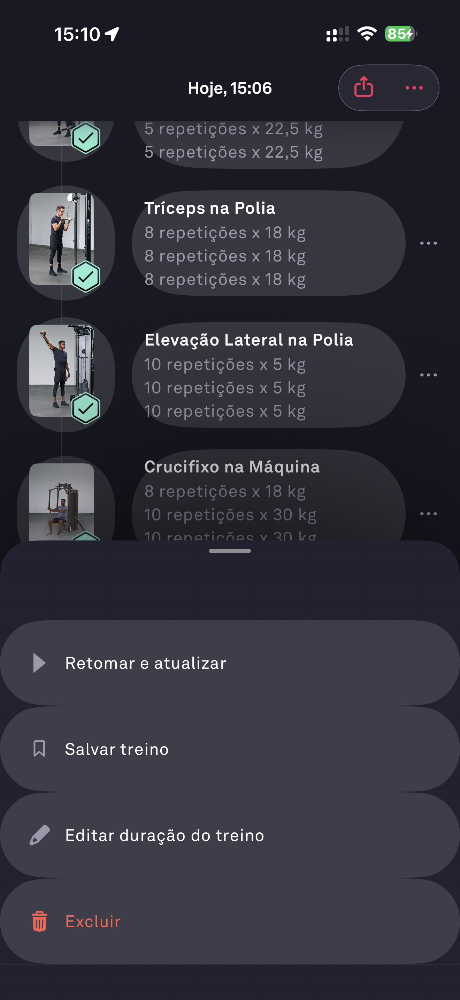

# 064 — Menu Treino Concluido

## Descrição fiel

Menu sobre o treino concluído com ações Retomar e atualizar, Salvar treino, Editar duração do treino e Excluir.

## Identificação

- **Aplicativo:** Fitbod
- **Arquivo:** `064-menu-treino-concluido.JPG`
- **Posição no conjunto:** 64 de 97

## Sequência

- **Anterior:** `063-compartilhar-cartao-detalhado.JPG`
- **Próxima:** `065-presente-primeiro-treino.JPG`
