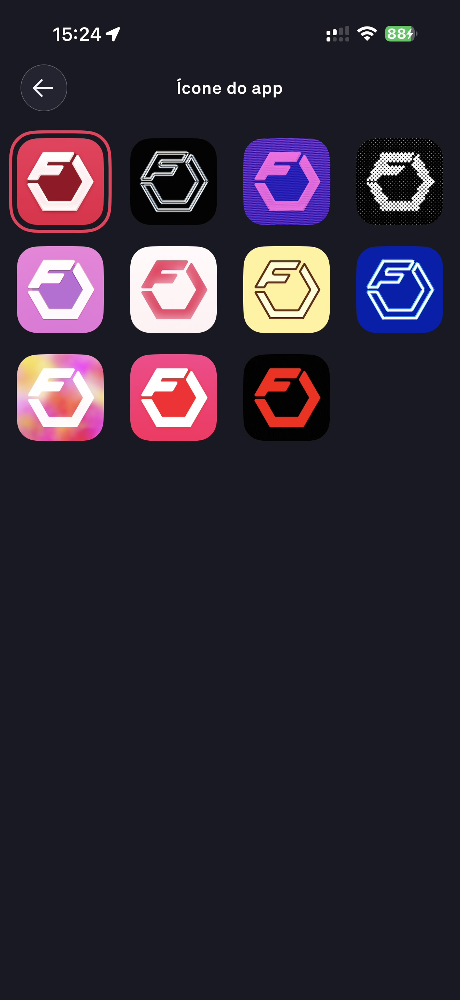

# 070 — Selecionar Icone Do App

## Descrição fiel

Tela “Ícone do app” com grade de onze variações coloridas do logotipo Fitbod; uma opção aparece selecionada.

## Identificação

- **Aplicativo:** Fitbod
- **Arquivo:** `070-selecionar-icone-do-app.JPG`
- **Posição no conjunto:** 70 de 97

## Sequência

- **Anterior:** `069-ajustes.JPG`
- **Próxima:** `071-gerenciar-assinatura.JPG`
