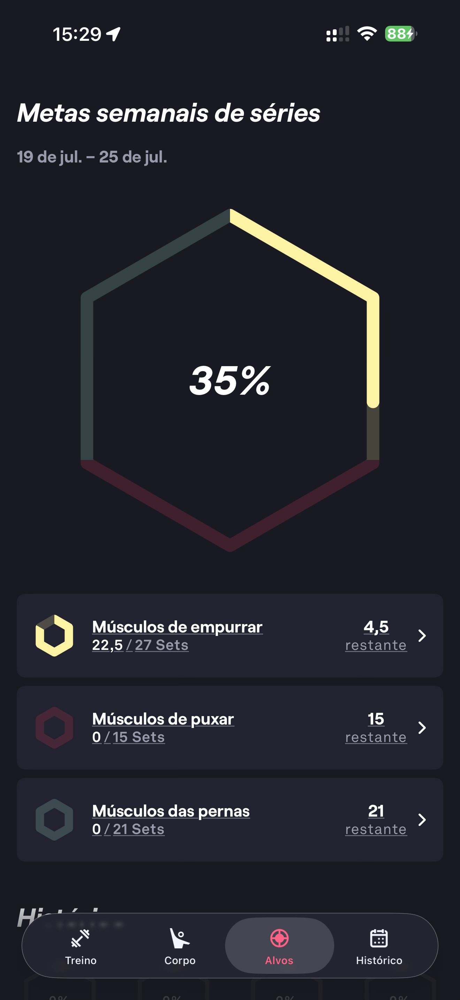

# 088 — Metas Semanais Series

## Descrição fiel

Tela “Metas semanais de séries”, período semanal, progresso hexagonal de 35% e categorias músculos de empurrar, puxar e pernas com séries restantes.

## Identificação

- **Aplicativo:** Fitbod
- **Arquivo:** `088-metas-semanais-series.JPG`
- **Posição no conjunto:** 88 de 97

## Sequência

- **Anterior:** `087-metas-semanais-apresentacao.JPG`
- **Próxima:** `089-metas-semanais-historico.JPG`
