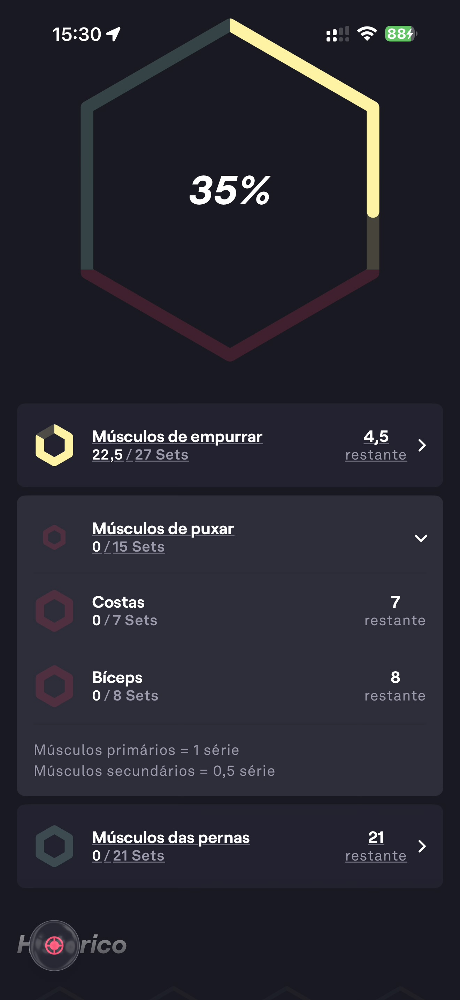

# 091 — Metas Semanais Detalhes Musculares

## Descrição fiel

Visão detalhada das metas musculares: empurrar expandido com Peito, Ombros e Tríceps, além de puxar e pernas abaixo.

## Identificação

- **Aplicativo:** Fitbod
- **Arquivo:** `091-metas-semanais-detalhes-musculares.JPG`
- **Posição no conjunto:** 91 de 97

## Sequência

- **Anterior:** `090-metas-semanais-musculos-de-empurrar.JPG`
- **Próxima:** `092-progresso-forca-geral.JPG`
