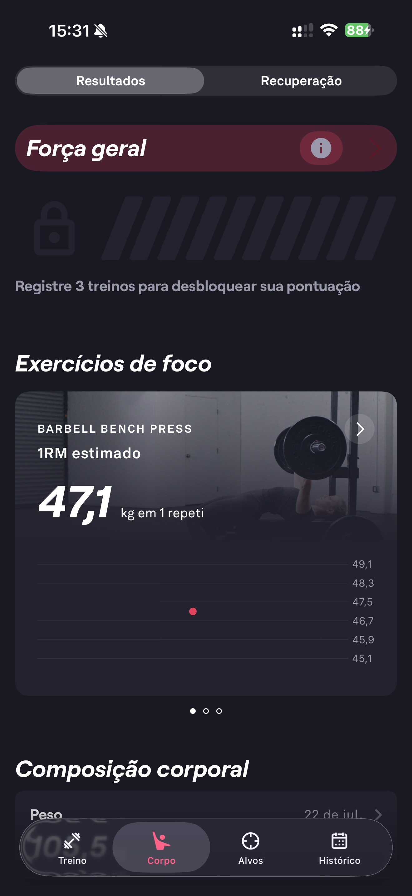

# 092 — Progresso Forca Geral

## Descrição fiel

Tela de progresso na aba Resultados, com cartão “Força geral” bloqueado até registrar três treinos, exercício de foco Supino e composição corporal.

## Identificação

- **Aplicativo:** Fitbod
- **Arquivo:** `092-progresso-forca-geral.JPG`
- **Posição no conjunto:** 92 de 97

## Sequência

- **Anterior:** `091-metas-semanais-detalhes-musculares.JPG`
- **Próxima:** `093-progresso-supino.JPG`
