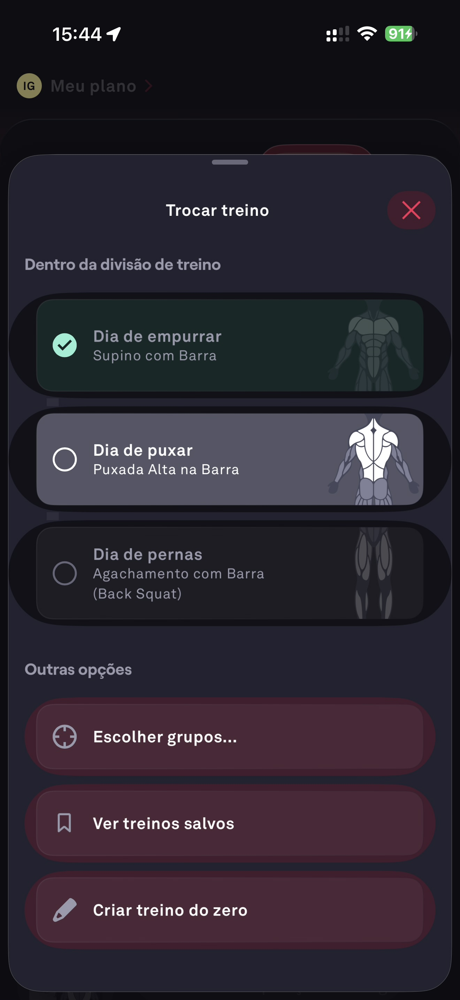

# 097 — Selecionar Dia De Treino

## Descrição fiel

Folha “Trocar treino” no Dia de puxar, mostrando Dia de empurrar concluído, Dia de puxar selecionado, Dia de pernas e opções adicionais.

## Identificação

- **Aplicativo:** Fitbod
- **Arquivo:** `097-selecionar-dia-de-treino.JPG`
- **Posição no conjunto:** 97 de 97

## Sequência

- **Anterior:** `096-treino-dia-de-puxar.JPG`
