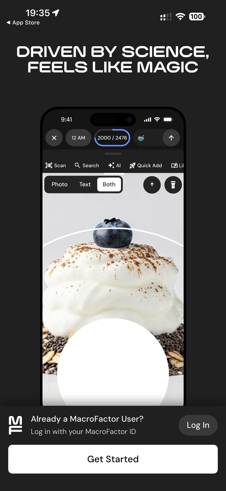

# 001 — Boas Vindas

## Descrição fiel

Fluxo inicial em tema escuro, com textos brancos, cartões contornados e ações de entrada, privacidade ou suporte. O conteúdo principal corresponde a “boas vindas”, com os dados, controles e ações associados visíveis na captura. A chamada “DRIVEN BY SCIENCE, FEELS LIKE MAGIC” aparece sobre uma imagem do app; há “Log In” e o botão “Get Started”.

## Elementos visuais e estado

- **Aplicativo:** MacroFactor.
- **Tema predominante:** interface escura, fundo preto/cinza, tipografia branca e cartões com bordas discretas.
- **Seção do fluxo:** Entrada e privacidade.
- **Estado documentado:** Boas Vindas.
- **Navegação:** barra superior com retorno ou título quando aplicável; ações principais aparecem geralmente em botão largo no rodapé; nas áreas principais do app há barra de abas inferior.

## Identificação

- **Arquivo da imagem:** `001-boas-vindas.JPG`
- **Posição no conjunto:** 1 de 186

## Sequência

- **Próxima:** `002-proteger-privacidade.JPG`
