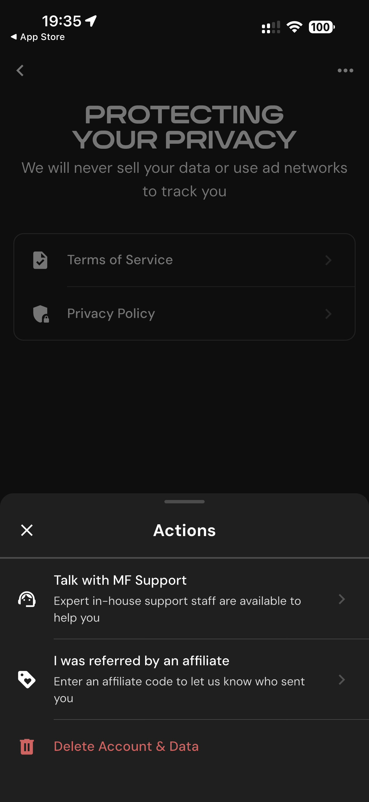

# 003 — Menu Acoes Privacidade

## Descrição fiel

Fluxo inicial em tema escuro, com textos brancos, cartões contornados e ações de entrada, privacidade ou suporte. O conteúdo enfatiza proteção dos dados e oferece acesso aos termos e à política de privacidade. Uma folha “Actions” está aberta com suporte, código de afiliado e “Delete Account & Data”.

## Elementos visuais e estado

- **Aplicativo:** MacroFactor.
- **Tema predominante:** interface escura, fundo preto/cinza, tipografia branca e cartões com bordas discretas.
- **Seção do fluxo:** Entrada e privacidade.
- **Estado documentado:** Menu Acoes Privacidade.
- **Navegação:** barra superior com retorno ou título quando aplicável; ações principais aparecem geralmente em botão largo no rodapé; nas áreas principais do app há barra de abas inferior.

## Identificação

- **Arquivo da imagem:** `003-menu-acoes-privacidade.JPG`
- **Posição no conjunto:** 3 de 186

## Sequência

- **Anterior:** `002-proteger-privacidade.JPG`
- **Próxima:** `004-suporte-por-email.JPG`
