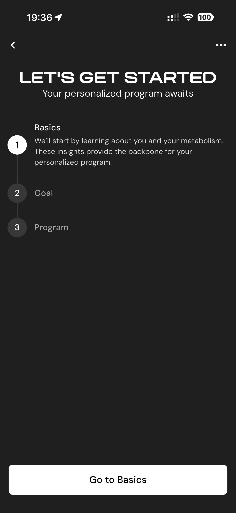

# 006 — Inicio Do Onboarding

## Descrição fiel

Etapa “Basics” do onboarding, em tema escuro, com barra de progresso superior, pergunta principal, opções selecionáveis e botão “Next” no rodapé. O conteúdo principal corresponde a “inicio do onboarding”, com os dados, controles e ações associados visíveis na captura. A tela “LET’S GET STARTED” apresenta as etapas Basics, Goal e Program e o botão “Go to Basics”.

## Elementos visuais e estado

- **Aplicativo:** MacroFactor.
- **Tema predominante:** interface escura, fundo preto/cinza, tipografia branca e cartões com bordas discretas.
- **Seção do fluxo:** Onboarding básico.
- **Estado documentado:** Inicio Do Onboarding.
- **Navegação:** barra superior com retorno ou título quando aplicável; ações principais aparecem geralmente em botão largo no rodapé; nas áreas principais do app há barra de abas inferior.

## Identificação

- **Arquivo da imagem:** `006-inicio-do-onboarding.JPG`
- **Posição no conjunto:** 6 de 186

## Sequência

- **Anterior:** `005-aceitar-privacidade.JPG`
- **Próxima:** `007-sincronizar-saude.JPG`
