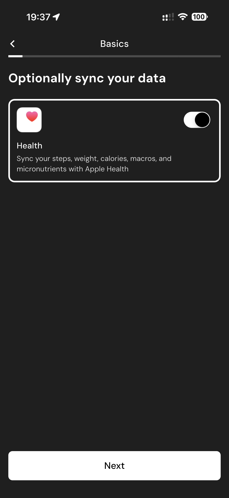

# 009 — Saude Ativada

## Descrição fiel

Etapa “Basics” do onboarding, em tema escuro, com barra de progresso superior, pergunta principal, opções selecionáveis e botão “Next” no rodapé. O controle correspondente aparece ligado, com a chave posicionada no estado ativo.

## Elementos visuais e estado

- **Aplicativo:** MacroFactor.
- **Tema predominante:** interface escura, fundo preto/cinza, tipografia branca e cartões com bordas discretas.
- **Seção do fluxo:** Onboarding básico.
- **Estado documentado:** Saude Ativada.
- **Navegação:** barra superior com retorno ou título quando aplicável; ações principais aparecem geralmente em botão largo no rodapé; nas áreas principais do app há barra de abas inferior.

## Identificação

- **Arquivo da imagem:** `009-saude-ativada.JPG`
- **Posição no conjunto:** 9 de 186

## Sequência

- **Anterior:** `008-permissoes-apple-health.JPG`
- **Próxima:** `010-selecionar-sexo.JPG`
