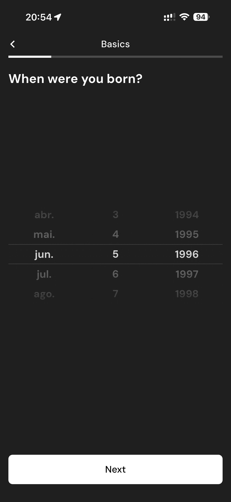

# 013 — Nascimento Selecionado

## Descrição fiel

Etapa “Basics” do onboarding, em tema escuro, com barra de progresso superior, pergunta principal, opções selecionáveis e botão “Next” no rodapé. A opção escolhida aparece destacada por borda clara e indicador circular preenchido.

## Elementos visuais e estado

- **Aplicativo:** MacroFactor.
- **Tema predominante:** interface escura, fundo preto/cinza, tipografia branca e cartões com bordas discretas.
- **Seção do fluxo:** Onboarding básico.
- **Estado documentado:** Nascimento Selecionado.
- **Navegação:** barra superior com retorno ou título quando aplicável; ações principais aparecem geralmente em botão largo no rodapé; nas áreas principais do app há barra de abas inferior.

## Identificação

- **Arquivo da imagem:** `013-nascimento-selecionado.JPG`
- **Posição no conjunto:** 13 de 186

## Sequência

- **Anterior:** `012-selecionar-nascimento.JPG`
- **Próxima:** `014-selecionar-altura.JPG`
