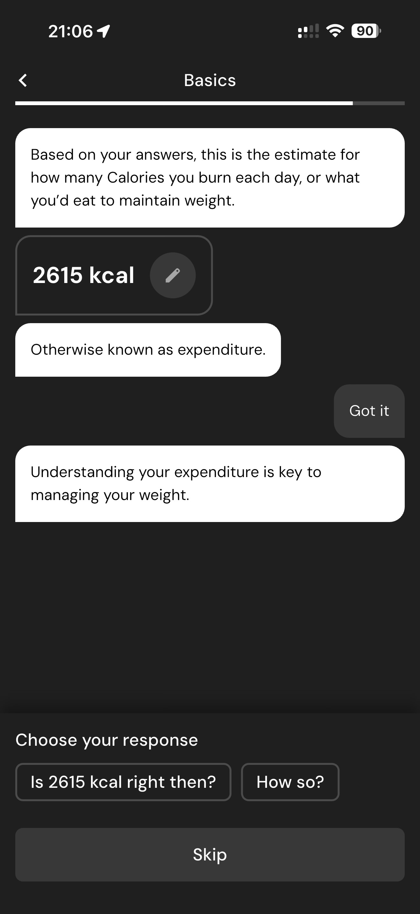

# 033 — Dialogo Gasto Calorico

## Descrição fiel

Continuação do onboarding com estimativa de gasto energético, diálogo explicativo, depoimentos e pergunta sobre como o usuário conheceu o app. O conteúdo principal corresponde a “dialogo gasto calorico”, com os dados, controles e ações associados visíveis na captura.

## Elementos visuais e estado

- **Aplicativo:** MacroFactor.
- **Tema predominante:** interface escura, fundo preto/cinza, tipografia branca e cartões com bordas discretas.
- **Seção do fluxo:** Metabolismo e origem.
- **Estado documentado:** Dialogo Gasto Calorico.
- **Navegação:** barra superior com retorno ou título quando aplicável; ações principais aparecem geralmente em botão largo no rodapé; nas áreas principais do app há barra de abas inferior.

## Identificação

- **Arquivo da imagem:** `033-dialogo-gasto-calorico.JPG`
- **Posição no conjunto:** 33 de 186

## Sequência

- **Anterior:** `032-explicacao-gasto-calorico.JPG`
- **Próxima:** `034-confirmar-gasto-calorico.JPG`
