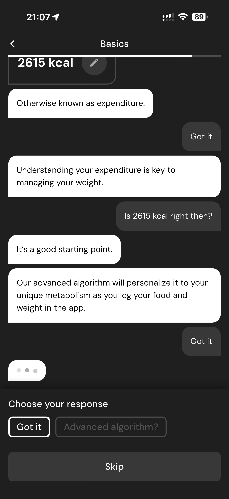

# 036 — Concluir Dialogo Metabolismo

## Descrição fiel

Continuação do onboarding com estimativa de gasto energético, diálogo explicativo, depoimentos e pergunta sobre como o usuário conheceu o app. A tela apresenta parâmetros da meta de peso, ritmo ou histórico de progresso.

## Elementos visuais e estado

- **Aplicativo:** MacroFactor.
- **Tema predominante:** interface escura, fundo preto/cinza, tipografia branca e cartões com bordas discretas.
- **Seção do fluxo:** Metabolismo e origem.
- **Estado documentado:** Concluir Dialogo Metabolismo.
- **Navegação:** barra superior com retorno ou título quando aplicável; ações principais aparecem geralmente em botão largo no rodapé; nas áreas principais do app há barra de abas inferior.

## Identificação

- **Arquivo da imagem:** `036-concluir-dialogo-metabolismo.JPG`
- **Posição no conjunto:** 36 de 186

## Sequência

- **Anterior:** `035-algoritmo-personalizado.JPG`
- **Próxima:** `037-depoimentos-usuarios.JPG`
