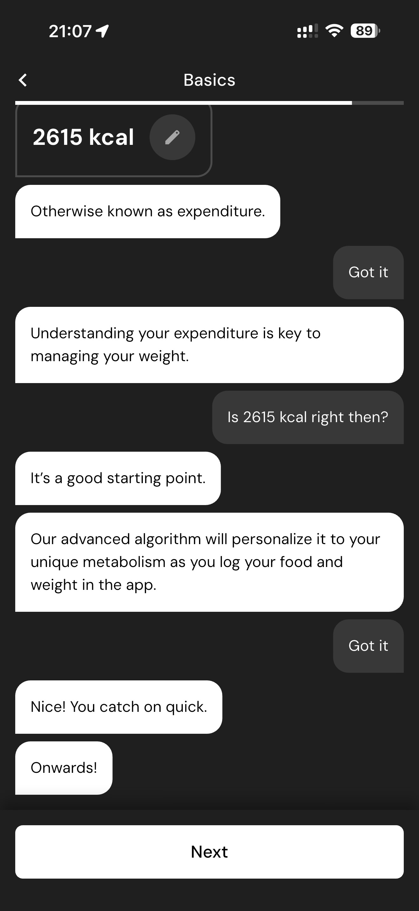

# 037 — Depoimentos Usuarios

## Descrição fiel

Continuação do onboarding com estimativa de gasto energético, diálogo explicativo, depoimentos e pergunta sobre como o usuário conheceu o app. O conteúdo principal corresponde a “depoimentos usuarios”, com os dados, controles e ações associados visíveis na captura. Cartões de depoimentos mostram avatares, nomes, avaliações de cinco estrelas e relatos de usuários.

## Elementos visuais e estado

- **Aplicativo:** MacroFactor.
- **Tema predominante:** interface escura, fundo preto/cinza, tipografia branca e cartões com bordas discretas.
- **Seção do fluxo:** Metabolismo e origem.
- **Estado documentado:** Depoimentos Usuarios.
- **Navegação:** barra superior com retorno ou título quando aplicável; ações principais aparecem geralmente em botão largo no rodapé; nas áreas principais do app há barra de abas inferior.

## Identificação

- **Arquivo da imagem:** `037-depoimentos-usuarios.JPG`
- **Posição no conjunto:** 37 de 186

## Sequência

- **Anterior:** `036-concluir-dialogo-metabolismo.JPG`
- **Próxima:** `038-mais-depoimentos.JPG`
