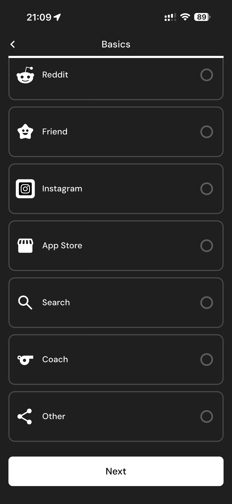

# 041 — Selecionar Objetivo

## Descrição fiel

Fluxo “Set New Goal”, com escolha do objetivo, peso-alvo, ritmo semanal, orçamento calórico e resumo calculado. A captura mostra a pergunta e as alternativas ainda disponíveis para escolha.

## Elementos visuais e estado

- **Aplicativo:** MacroFactor.
- **Tema predominante:** interface escura, fundo preto/cinza, tipografia branca e cartões com bordas discretas.
- **Seção do fluxo:** Definição da meta.
- **Estado documentado:** Selecionar Objetivo.
- **Navegação:** barra superior com retorno ou título quando aplicável; ações principais aparecem geralmente em botão largo no rodapé; nas áreas principais do app há barra de abas inferior.

## Identificação

- **Arquivo da imagem:** `041-selecionar-objetivo.JPG`
- **Posição no conjunto:** 41 de 186

## Sequência

- **Anterior:** `040-origem-app-store.JPG`
- **Próxima:** `042-objetivo-perder-peso.JPG`
