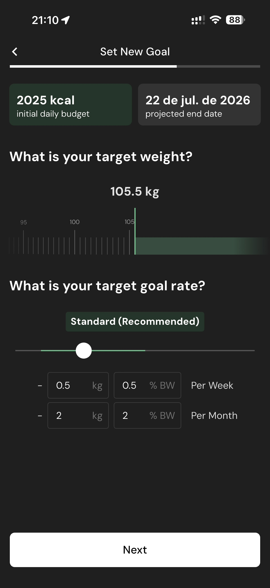

# 044 — Resumo Meta

## Descrição fiel

Fluxo “Set New Goal”, com escolha do objetivo, peso-alvo, ritmo semanal, orçamento calórico e resumo calculado. A tela apresenta parâmetros da meta de peso, ritmo ou histórico de progresso. O resumo informa perda de peso, peso inicial/meta, taxa semanal, orçamento calórico e data estimada.

## Elementos visuais e estado

- **Aplicativo:** MacroFactor.
- **Tema predominante:** interface escura, fundo preto/cinza, tipografia branca e cartões com bordas discretas.
- **Seção do fluxo:** Definição da meta.
- **Estado documentado:** Resumo Meta.
- **Navegação:** barra superior com retorno ou título quando aplicável; ações principais aparecem geralmente em botão largo no rodapé; nas áreas principais do app há barra de abas inferior.

## Identificação

- **Arquivo da imagem:** `044-resumo-meta.JPG`
- **Posição no conjunto:** 44 de 186

## Sequência

- **Anterior:** `043-peso-meta-e-ritmo.JPG`
- **Próxima:** `045-ajustar-peso-meta.JPG`
