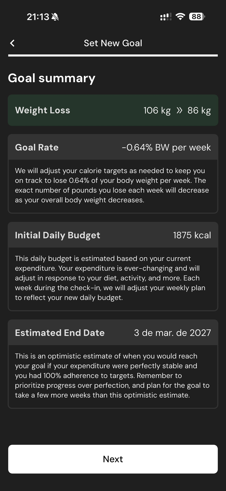

# 047 — Etapas Onboarding Concluidas

## Descrição fiel

Fluxo “Set New Program”, com dieta, piso calórico, treinamento, distribuição de calorias, dias altos e proteína preferida. O conteúdo principal corresponde a “etapas onboarding concluidas”, com os dados, controles e ações associados visíveis na captura.

## Elementos visuais e estado

- **Aplicativo:** MacroFactor.
- **Tema predominante:** interface escura, fundo preto/cinza, tipografia branca e cartões com bordas discretas.
- **Seção do fluxo:** Configuração do programa.
- **Estado documentado:** Etapas Onboarding Concluidas.
- **Navegação:** barra superior com retorno ou título quando aplicável; ações principais aparecem geralmente em botão largo no rodapé; nas áreas principais do app há barra de abas inferior.

## Identificação

- **Arquivo da imagem:** `047-etapas-onboarding-concluidas.JPG`
- **Posição no conjunto:** 47 de 186

## Sequência

- **Anterior:** `046-resumo-meta-atualizado.JPG`
- **Próxima:** `048-dieta-preferida.JPG`
