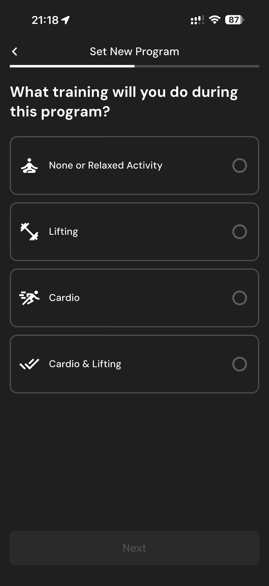

# 051 — Musculacao Selecionada

## Descrição fiel

Fluxo “Set New Program”, com dieta, piso calórico, treinamento, distribuição de calorias, dias altos e proteína preferida. O conteúdo principal corresponde a “musculacao selecionada”, com os dados, controles e ações associados visíveis na captura.

## Elementos visuais e estado

- **Aplicativo:** MacroFactor.
- **Tema predominante:** interface escura, fundo preto/cinza, tipografia branca e cartões com bordas discretas.
- **Seção do fluxo:** Configuração do programa.
- **Estado documentado:** Musculacao Selecionada.
- **Navegação:** barra superior com retorno ou título quando aplicável; ações principais aparecem geralmente em botão largo no rodapé; nas áreas principais do app há barra de abas inferior.

## Identificação

- **Arquivo da imagem:** `051-musculacao-selecionada.JPG`
- **Posição no conjunto:** 51 de 186

## Sequência

- **Anterior:** `050-atividade-do-programa.JPG`
- **Próxima:** `052-distribuicao-calorias.JPG`
