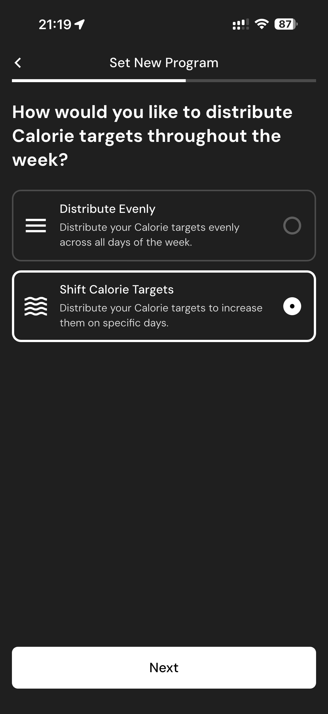

# 054 — Dias Metas Altas

## Descrição fiel

Fluxo “Set New Program”, com dieta, piso calórico, treinamento, distribuição de calorias, dias altos e proteína preferida. A tela apresenta parâmetros da meta de peso, ritmo ou histórico de progresso.

## Elementos visuais e estado

- **Aplicativo:** MacroFactor.
- **Tema predominante:** interface escura, fundo preto/cinza, tipografia branca e cartões com bordas discretas.
- **Seção do fluxo:** Configuração do programa.
- **Estado documentado:** Dias Metas Altas.
- **Navegação:** barra superior com retorno ou título quando aplicável; ações principais aparecem geralmente em botão largo no rodapé; nas áreas principais do app há barra de abas inferior.

## Identificação

- **Arquivo da imagem:** `054-dias-metas-altas.JPG`
- **Posição no conjunto:** 54 de 186

## Sequência

- **Anterior:** `053-alternar-metas-caloricas.JPG`
- **Próxima:** `055-fim-de-semana-selecionado.JPG`
