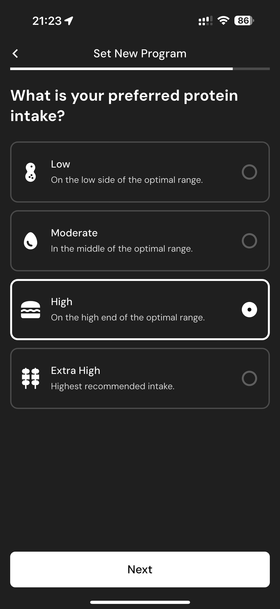

# 059 — Calculando Programa

## Descrição fiel

Fluxo “Set New Program”, com dieta, piso calórico, treinamento, distribuição de calorias, dias altos e proteína preferida. A tela apresenta dados do programa calculado ou controles para configurá-lo. Uma animação orbital acompanha o texto de cálculo do programa e o botão “Done” permanece desabilitado.

## Elementos visuais e estado

- **Aplicativo:** MacroFactor.
- **Tema predominante:** interface escura, fundo preto/cinza, tipografia branca e cartões com bordas discretas.
- **Seção do fluxo:** Configuração do programa.
- **Estado documentado:** Calculando Programa.
- **Navegação:** barra superior com retorno ou título quando aplicável; ações principais aparecem geralmente em botão largo no rodapé; nas áreas principais do app há barra de abas inferior.

## Identificação

- **Arquivo da imagem:** `059-calculando-programa.JPG`
- **Posição no conjunto:** 59 de 186

## Sequência

- **Anterior:** `058-proteina-alta.JPG`
- **Próxima:** `060-programa-de-macros-pronto.JPG`
