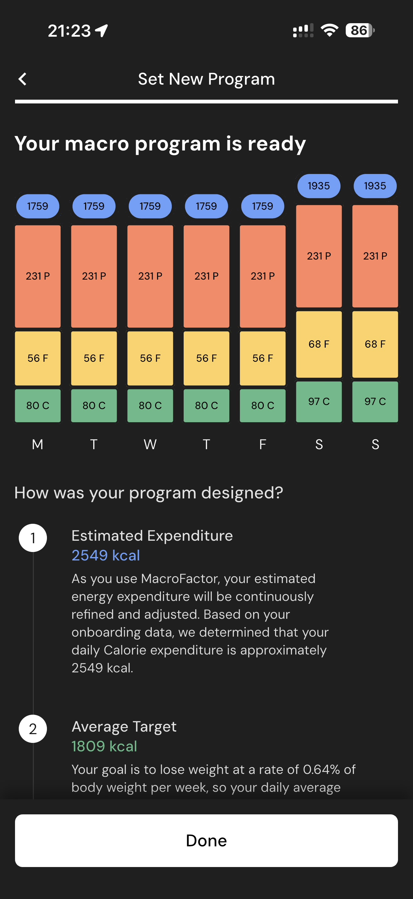

# 061 — Detalhes Programa Macros

## Descrição fiel

Resultado do programa e carrossel de apresentação dos recursos do MacroFactor, com mockups do app e botão de avanço. A tela apresenta dados do programa calculado ou controles para configurá-lo.

## Elementos visuais e estado

- **Aplicativo:** MacroFactor.
- **Tema predominante:** interface escura, fundo preto/cinza, tipografia branca e cartões com bordas discretas.
- **Seção do fluxo:** Resultado e apresentação.
- **Estado documentado:** Detalhes Programa Macros.
- **Navegação:** barra superior com retorno ou título quando aplicável; ações principais aparecem geralmente em botão largo no rodapé; nas áreas principais do app há barra de abas inferior.

## Identificação

- **Arquivo da imagem:** `061-detalhes-programa-macros.JPG`
- **Posição no conjunto:** 61 de 186

## Sequência

- **Anterior:** `060-programa-de-macros-pronto.JPG`
- **Próxima:** `062-detalhes-calorias-e-proteina.JPG`
