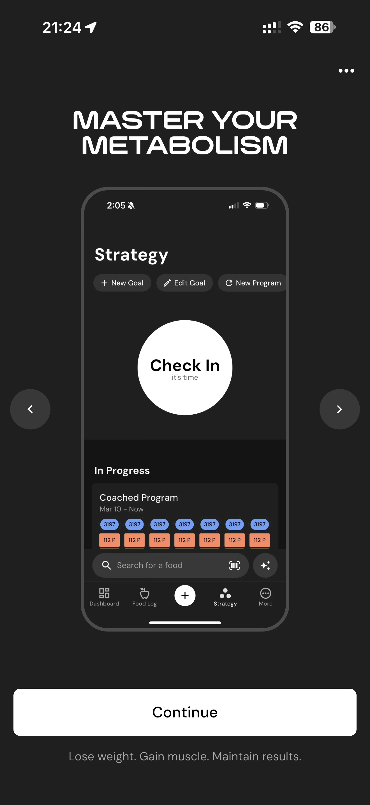

# 064 — Domine Seu Metabolismo

## Descrição fiel

Resultado do programa e carrossel de apresentação dos recursos do MacroFactor, com mockups do app e botão de avanço. A tela apresenta parâmetros da meta de peso, ritmo ou histórico de progresso.

## Elementos visuais e estado

- **Aplicativo:** MacroFactor.
- **Tema predominante:** interface escura, fundo preto/cinza, tipografia branca e cartões com bordas discretas.
- **Seção do fluxo:** Resultado e apresentação.
- **Estado documentado:** Domine Seu Metabolismo.
- **Navegação:** barra superior com retorno ou título quando aplicável; ações principais aparecem geralmente em botão largo no rodapé; nas áreas principais do app há barra de abas inferior.

## Identificação

- **Arquivo da imagem:** `064-domine-seu-metabolismo.JPG`
- **Posição no conjunto:** 64 de 186

## Sequência

- **Anterior:** `063-detalhes-mudanca-calorica.JPG`
- **Próxima:** `065-acompanhe-macro-e-micronutrientes.JPG`
