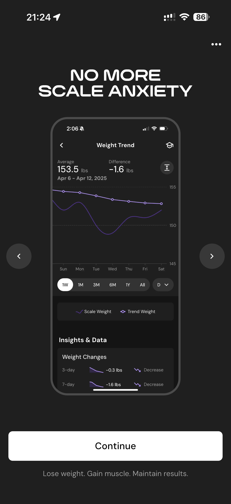

# 066 — Sem Ansiedade Da Balanca

## Descrição fiel

Resultado do programa e carrossel de apresentação dos recursos do MacroFactor, com mockups do app e botão de avanço. O conteúdo principal corresponde a “sem ansiedade da balanca”, com os dados, controles e ações associados visíveis na captura.

## Elementos visuais e estado

- **Aplicativo:** MacroFactor.
- **Tema predominante:** interface escura, fundo preto/cinza, tipografia branca e cartões com bordas discretas.
- **Seção do fluxo:** Resultado e apresentação.
- **Estado documentado:** Sem Ansiedade Da Balanca.
- **Navegação:** barra superior com retorno ou título quando aplicável; ações principais aparecem geralmente em botão largo no rodapé; nas áreas principais do app há barra de abas inferior.

## Identificação

- **Arquivo da imagem:** `066-sem-ansiedade-da-balanca.JPG`
- **Posição no conjunto:** 66 de 186

## Sequência

- **Anterior:** `065-acompanhe-macro-e-micronutrientes.JPG`
- **Próxima:** `067-metabolismo-personalizado.JPG`
