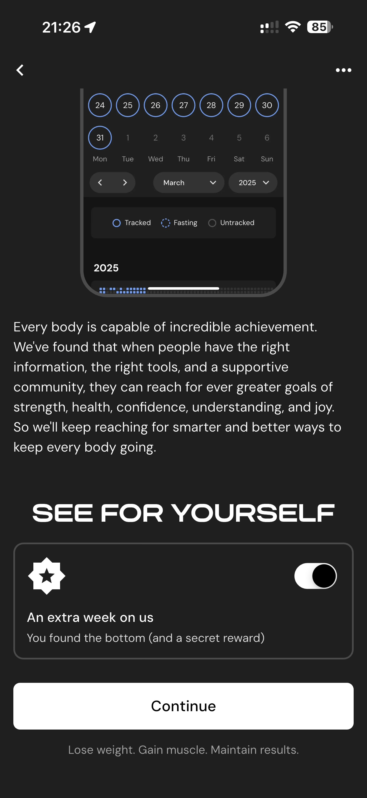

# 075 — Semana Extra Ativada

## Descrição fiel

Resultado do programa e carrossel de apresentação dos recursos do MacroFactor, com mockups do app e botão de avanço. O controle correspondente aparece ligado, com a chave posicionada no estado ativo.

## Elementos visuais e estado

- **Aplicativo:** MacroFactor.
- **Tema predominante:** interface escura, fundo preto/cinza, tipografia branca e cartões com bordas discretas.
- **Seção do fluxo:** Resultado e apresentação.
- **Estado documentado:** Semana Extra Ativada.
- **Navegação:** barra superior com retorno ou título quando aplicável; ações principais aparecem geralmente em botão largo no rodapé; nas áreas principais do app há barra de abas inferior.

## Identificação

- **Arquivo da imagem:** `075-semana-extra-ativada.JPG`
- **Posição no conjunto:** 75 de 186

## Sequência

- **Anterior:** `074-semana-extra.JPG`
- **Próxima:** `076-escolher-plano.JPG`
