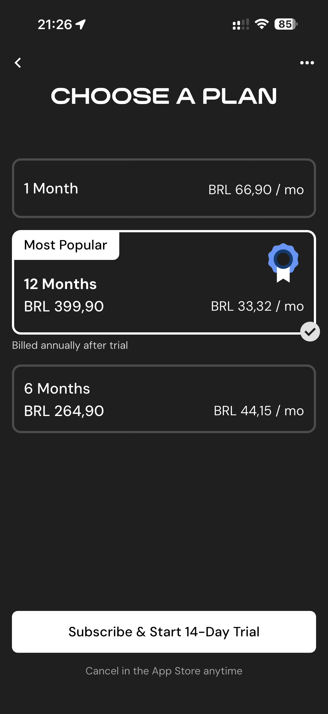

# 076 — Escolher Plano

## Descrição fiel

Escolha de plano, Apple Pay, criação de conta, primeiros 30 dias e consentimentos de saúde e privacidade. O conteúdo principal corresponde a “escolher plano”, com os dados, controles e ações associados visíveis na captura. A tela “CHOOSE A PLAN” mostra opções de 1, 6 e 12 meses; 12 meses está marcado como “Most Popular”.

## Elementos visuais e estado

- **Aplicativo:** MacroFactor.
- **Tema predominante:** interface escura, fundo preto/cinza, tipografia branca e cartões com bordas discretas.
- **Seção do fluxo:** Assinatura, conta e consentimento.
- **Estado documentado:** Escolher Plano.
- **Navegação:** barra superior com retorno ou título quando aplicável; ações principais aparecem geralmente em botão largo no rodapé; nas áreas principais do app há barra de abas inferior.

## Identificação

- **Arquivo da imagem:** `076-escolher-plano.JPG`
- **Posição no conjunto:** 76 de 186

## Sequência

- **Anterior:** `075-semana-extra-ativada.JPG`
- **Próxima:** `077-pagamento-apple-pay.JPG`
