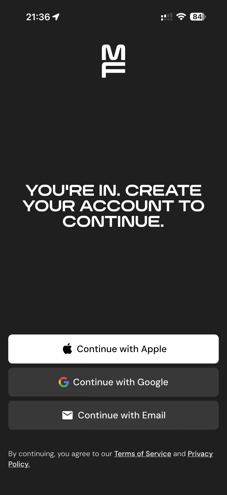

# 079 — Criar Conta

## Descrição fiel

Escolha de plano, Apple Pay, criação de conta, primeiros 30 dias e consentimentos de saúde e privacidade. O conteúdo principal corresponde a “criar conta”, com os dados, controles e ações associados visíveis na captura.

## Elementos visuais e estado

- **Aplicativo:** MacroFactor.
- **Tema predominante:** interface escura, fundo preto/cinza, tipografia branca e cartões com bordas discretas.
- **Seção do fluxo:** Assinatura, conta e consentimento.
- **Estado documentado:** Criar Conta.
- **Navegação:** barra superior com retorno ou título quando aplicável; ações principais aparecem geralmente em botão largo no rodapé; nas áreas principais do app há barra de abas inferior.

## Identificação

- **Arquivo da imagem:** `079-criar-conta.JPG`
- **Posição no conjunto:** 79 de 186

## Sequência

- **Anterior:** `078-criar-conta-celebracao.JPG`
- **Próxima:** `080-primeiros-trinta-dias.JPG`
