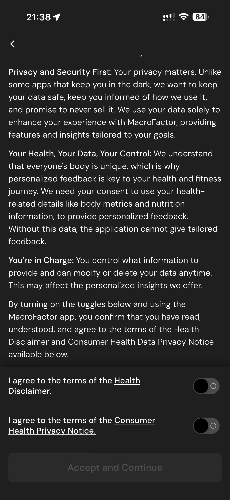

# 082 — Termos Saude

## Descrição fiel

Escolha de plano, Apple Pay, criação de conta, primeiros 30 dias e consentimentos de saúde e privacidade. O conteúdo principal corresponde a “termos saude”, com os dados, controles e ações associados visíveis na captura.

## Elementos visuais e estado

- **Aplicativo:** MacroFactor.
- **Tema predominante:** interface escura, fundo preto/cinza, tipografia branca e cartões com bordas discretas.
- **Seção do fluxo:** Assinatura, conta e consentimento.
- **Estado documentado:** Termos Saude.
- **Navegação:** barra superior com retorno ou título quando aplicável; ações principais aparecem geralmente em botão largo no rodapé; nas áreas principais do app há barra de abas inferior.

## Identificação

- **Arquivo da imagem:** `082-termos-saude.JPG`
- **Posição no conjunto:** 82 de 186

## Sequência

- **Anterior:** `081-aviso-saude-e-privacidade.JPG`
- **Próxima:** `083-termos-saude-aceitos.JPG`
