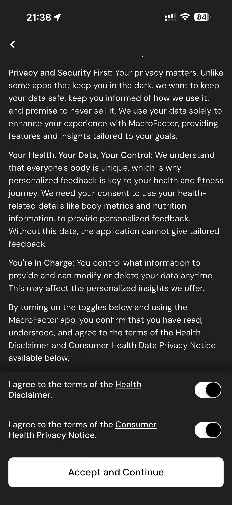

# 083 — Termos Saude Aceitos

## Descrição fiel

Escolha de plano, Apple Pay, criação de conta, primeiros 30 dias e consentimentos de saúde e privacidade. As duas chaves de consentimento aparecem ligadas e o botão “Accept and Continue” está habilitado.

## Elementos visuais e estado

- **Aplicativo:** MacroFactor.
- **Tema predominante:** interface escura, fundo preto/cinza, tipografia branca e cartões com bordas discretas.
- **Seção do fluxo:** Assinatura, conta e consentimento.
- **Estado documentado:** Termos Saude Aceitos.
- **Navegação:** barra superior com retorno ou título quando aplicável; ações principais aparecem geralmente em botão largo no rodapé; nas áreas principais do app há barra de abas inferior.

## Identificação

- **Arquivo da imagem:** `083-termos-saude-aceitos.JPG`
- **Posição no conjunto:** 83 de 186

## Sequência

- **Anterior:** `082-termos-saude.JPG`
- **Próxima:** `084-dashboard-nutricao-semanal.JPG`
