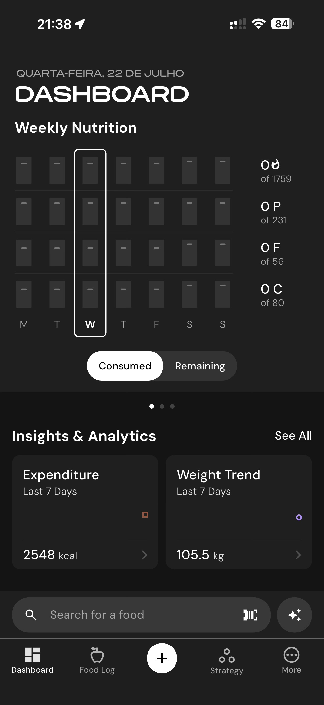

# 088 — Dashboard Semanal

## Descrição fiel

Dashboard escuro com nutrição semanal/diária, balanço energético, insights, hábitos, métricas corporais e navegação inferior. A navegação inferior mostra a aba Dashboard e o conteúdo é organizado em cartões de métricas.

## Elementos visuais e estado

- **Aplicativo:** MacroFactor.
- **Tema predominante:** interface escura, fundo preto/cinza, tipografia branca e cartões com bordas discretas.
- **Seção do fluxo:** Dashboard.
- **Estado documentado:** Dashboard Semanal.
- **Navegação:** barra superior com retorno ou título quando aplicável; ações principais aparecem geralmente em botão largo no rodapé; nas áreas principais do app há barra de abas inferior.

## Identificação

- **Arquivo da imagem:** `088-dashboard-semanal.JPG`
- **Posição no conjunto:** 88 de 186

## Sequência

- **Anterior:** `087-dashboard-calorias-restantes.JPG`
- **Próxima:** `089-dashboard-insights-e-habitos.JPG`
